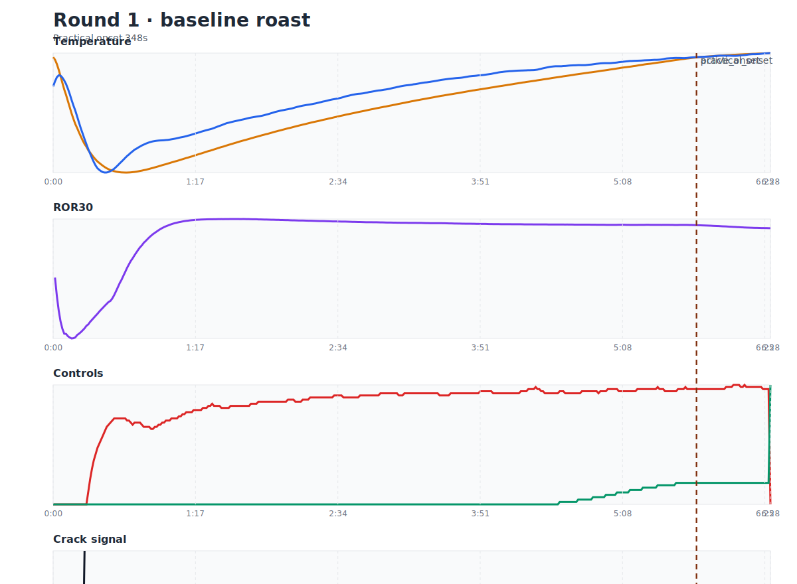
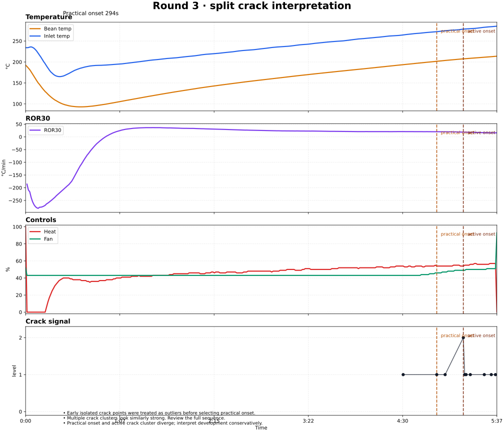

# Roest Analysis — AI-first 咖啡烘焙闭环

[English version below](#english-version)

---

## 为什么做这件事

烘豆长期以来是一门高度依赖个人感官和肌肉记忆的技艺：听一爆声判断进度、看豆色推测发展程度、手动调风门和火力、凭经验决定下豆时机。这套模式培养了很多优秀的手工烘焙师，但它有一个根本瓶颈——知识锁死在人身上，难以复制、难以迭代、难以规模化。

新一代可编程烘焙机（比如 Roest）正在从硬件层面改变这个问题的形态。传感器阵列取代了人耳和人眼做 perception，PID 温控和可编程 profile 取代了手动旋钮做 control，批次一致性大幅提升。这把烘焙者从体力活和肌肉记忆中解放出来，精力可以转向更有价值的方向：理解烘焙原理、分析风味表现、设计和迭代策略。

但硬件只解决了半个问题。传感器产生了远超人能实时处理的数据量，如果这些数据仍然需要人来手动解读、手动记录、手动对比，效率瓶颈只是换了一个位置。过去即使引入 AI，也需要人先用自然语言描述 ROR 走势、下豆温度、风门变化，AI 才能开始工作。这个中间翻译层既慢又有信息损失。

Roest 的 API 消除了这个翻译层。它直接输出结构化 JSON——完整的时间序列温度、ROR、控制量、crack 检测信号。AI agent 可以自主 pull 数据、写分析程序、调用诊断规则、生成可视化，驱动整个从数据到洞察的流程，无需人在中间做格式转换。AI 在这个场景里是 first-class citizen：它可以主动拉取、主动分析、主动推荐，和人共用同一套命令、同一套分析规则、同一套图表输出。

这个项目就是这条路径的实现：一个 AI 和人都能稳定调用的 roast log 诊断系统。未来的价值增长更可能来自 domain knowledge 的注入——烘焙原理、豆种特性、风味化学编码成 skill 和 knowledge base，让 AI 在通用能力之上获得领域深度。方向是把烘豆从偏艺术的个人技艺，推向可复制、可迭代、可产品化的系统。

这个 repo 证明它可行：API 已打通、分析规则已编码、可视化已落地、live tests 已覆盖真实数据。

## 核心能力

- 从 Roest API 拉取 log、datapoints、machine logs、machine slots
- 基于 log ID 分析 roast 的 phase metrics 和 crack 序列
- 区分 practical onset 和 active crack cluster，拒绝把第一个孤立 crack 点当 ground truth
- 输出可嵌入文档的 roast visualization（matplotlib 渲染 SVG）
- live integration tests 默认 skip，显式启用时才走真实 credential

## 快速开始

```bash
python -m venv .venv
source .venv/bin/activate
pip install -e .

cp .env.example .env
# 填入 ROEST_API_TOKEN 和 ROEST_MACHINE_ID

python -m pytest -v
python -m roest_analysis.cli doctor config
python -m roest_analysis.cli machine logs --machine-id "$ROEST_MACHINE_ID"
python -m roest_analysis.cli log analyze --log-id <log-id>
python -m roest_analysis.cli log plot --log-id <log-id> --output docs/assets/example.svg
```

也可以直接用项目脚本：

```bash
scripts/roest doctor config
scripts/roest log analyze --log-id <log-id>
```

## 核心命令

```bash
python -m roest_analysis.cli doctor config
python -m roest_analysis.cli log fetch --log-id <log-id> --resource bundle --format json
python -m roest_analysis.cli log analyze --log-id <log-id> --format text
python -m roest_analysis.cli log plot --log-id <log-id> --output docs/assets/roast.svg
python -m roest_analysis.cli machine logs --machine-id "$ROEST_MACHINE_ID"
python -m roest_analysis.cli machine slots --machine-id "$ROEST_MACHINE_ID"
python -m roest_analysis.cli machine flagged-logs --machine-id "$ROEST_MACHINE_ID" --event-flags 36
```

## Visualization 怎么看

每张图有四个面板：Temperature（bean + inlet）、ROR30（按每分钟表示的平滑升温速度）、Controls（heat + fan）、Crack signal（所有非零 crack 点及 onset 标线）。四个面板共享时间轴，practical onset 和 active onset 以垂直虚线贯穿全图。

图表的核心价值在于让你同时看到温度走向、升温速率、控制动作和 crack 信号之间的时间关系。具体看什么取决于你在诊断什么问题——development 偏短要关注 onset 之后的 ROR 和 heat 变化，crack 信号不一致要关注 practical 和 active onset 的分离程度，ROR 异常要和 heat/fan 的控制动作对照。

## 案例研究

### 案例一：第一轮，完整但 development 偏短



**What**：这锅的一爆比较集中，没有 split-cluster 的歧义，但 development 只有约 40 秒，development ratio 约 10.3%，ΔBT 也只有约 4.7°C。换句话说，曲线虽然完整走完了，但一爆后真正能给豆子建立可溶性和结构的窗口很短。

**Diagnosis**：这和杯测是对得上的。espresso 表现为尖酸、加奶后风味很快塌掉、即使提高浓度和萃取也还是缺 body。这里的核心不是“单纯萃取不足”，而是 roast 本身没有把后段结构做出来。把技术指标和 cup notes 放在一起看，更合理的判断是：这锅的一爆后发展不够，豆子在 espresso 维度上的甜感、厚度和乳饮穿透力没有建立起来。

**Risks**：如果把它误判成冲煮问题，后面就会一直在 recipe 上补救——磨更细、拉更长、提高萃取——但杯子只会更尖、更干，不会真的长出 body。风险不在于“萃不出来”，而在于 roast 本身没有给出那个结构基础。

**Next**：下一锅不该只是“再萃深一点”，而是直接改 roast。先把一爆前后的能量衔接做平顺，避免刚进 crack 就急着下豆；再把 development 从 40 秒往 55 到 70 秒的区间试，看看甜感、厚度和奶饮穿透力会不会明显回来。这个案例展示的不是系统会报几个数字，而是它能把数字、杯测和下一锅动作连成一个可执行的判断。

### 案例二：第三轮，典型的两阶段 crack



**What**：这锅最显眼的特征不是某一个单独数值，而是 crack signal 本身分成了两段：较早的 practical onset，和更晚才开始成簇、像主体一爆的 active cluster。也就是说，系统能看到 crack 开始了，但真正持续、成簇、强度更高的 crack body 出现在后面。

**Diagnosis**：这里真正有价值的不是强行选一个“唯一正确”的一爆时间点，而是承认 development 的定义开始摇摆。如果拿最早那个点算 development，会高估；如果只拿后面的 active cluster，又会忽略前面已经开始出现的结构变化。系统在这里的诊断能力不是替你编一个确定答案，而是明确告诉你：这锅的数据本身带歧义，所以结论必须更保守。

**Risks**：最常见的误区是把问题理解成“让 crack 不要分簇”。这其实不靠谱，因为分簇里可能混着传感器噪声，也可能混着豆子层面的离散性，未必是一个能直接控制的表象。真正可控、也更值得看的，是 crack 前后热量和控制动作本身。

**Next**：下一锅更具体的检查窗口是 crack 前 30 到 60 秒。先看 heat / fan 有没有让豆子带着过高热动量进入一爆，再看一爆附近的控制动作是不是过于跳变。如果要改，优先改这里的热量管理，而不是把目标写成“修掉分簇”。这个案例想展示的是：系统在面对模糊数据时，不是假装精确，而是把注意力重新拉回到真正可控的 roast structure 上。

## 测试策略

默认 `pytest` 跑 unit tests 和 mocked integration tests，live tests 默认 skip。真实 API 集成测试需要 `.env` 配好并显式启用：

```bash
python -m pytest -v
ROEST_ENABLE_LIVE_TESTS=1 python -m pytest -v -m live_integration
```

## 安全与公开仓库注意事项

`.env` 是本地文件，已经 gitignore。`.env.example` 只保留占位符，不带真实 token 或 machine id。README、测试和示例图中不使用真实 machine id，`doctor config` 只输出 masked token。

## 给 AI 的提示

AI agent 在这个项目中是 first-class 参与者，可以自主拉取数据、运行分析、生成可视化。`CLAUDE.md` 描述了工作环境和安全边界，`skills/roest_analysis.md` 记录了分析规则和常见坑。从全局 skills 入口进入时，对应的 wrapper 在 `rules/skills/roest_analysis.md`。

---

<a id="english-version"></a>

# English Version: Roest Analysis — AI-first Coffee Roasting Loop

## Why This Exists

Coffee roasting has long been a craft locked inside individual sensory experience and muscle memory: listening for first crack, watching bean color, manually adjusting airflow and heat, deciding the drop point by feel. This model produced skilled artisan roasters, but it has a fundamental bottleneck — knowledge is trapped in individuals, difficult to replicate, difficult to iterate, difficult to scale.

A new generation of programmable roasters (like Roest) is reshaping the problem from the hardware level. Sensor arrays replace human ears and eyes for perception; PID temperature control and programmable profiles replace manual knobs for control; batch-to-batch consistency improves dramatically. This frees the roaster from physical execution and muscle memory, redirecting attention to higher-value work: understanding roasting principles, analyzing flavor performance, designing and iterating strategies.

But hardware only solves half the problem. Sensors generate far more data than a human can process in real time. If that data still requires manual interpretation, manual logging, and manual comparison, the efficiency bottleneck simply moves. In the past, even when AI was introduced, a human had to first describe ROR trends, drop temperature, and airflow changes in natural language before AI could begin. This translation layer was slow and lossy.

Roest's API eliminates this translation layer. It outputs structured JSON directly — complete time-series temperature, ROR, control settings, and crack detection signals. An AI agent can autonomously pull data, run analysis, invoke diagnostic rules, generate visualizations, and drive the entire data-to-insight pipeline with no human format conversion in between. AI is a first-class citizen in this workflow: it can proactively fetch, analyze, and recommend, sharing the same commands, analysis rules, and chart outputs as a human user.

This project is that path realized: a roast log diagnostic system that both AI and humans can reliably call. Future value growth is more likely to come from domain knowledge injection — roasting principles, bean characteristics, and flavor chemistry encoded as skills and knowledge bases — giving AI domain depth on top of general capability. The direction is to move coffee roasting from artisan craft toward a replicable, iterable, productizable system.

This repo proves it is viable: the API pipeline works, analysis rules are codified, visualizations are production-ready, and live tests cover real data.

## Core Capabilities

- Fetch logs, datapoints, machine logs, and machine slots from the Roest API
- Analyze phase metrics and crack sequences by log ID
- Distinguish practical onset from active crack cluster — refuses to treat the first isolated crack point as ground truth
- Output embeddable roast visualizations (matplotlib-rendered SVG)
- Live integration tests skip by default, run only with explicit credentials

## Quick Start

```bash
python -m venv .venv
source .venv/bin/activate
pip install -e .

cp .env.example .env
# Fill in ROEST_API_TOKEN and ROEST_MACHINE_ID

python -m pytest -v
python -m roest_analysis.cli doctor config
python -m roest_analysis.cli machine logs --machine-id "$ROEST_MACHINE_ID"
python -m roest_analysis.cli log analyze --log-id <log-id>
python -m roest_analysis.cli log plot --log-id <log-id> --output docs/assets/example.svg
```

Or use the project scripts directly:

```bash
scripts/roest doctor config
scripts/roest log analyze --log-id <log-id>
```

## Key Commands

```bash
python -m roest_analysis.cli doctor config
python -m roest_analysis.cli log fetch --log-id <log-id> --resource bundle --format json
python -m roest_analysis.cli log analyze --log-id <log-id> --format text
python -m roest_analysis.cli log plot --log-id <log-id> --output docs/assets/roast.svg
python -m roest_analysis.cli machine logs --machine-id "$ROEST_MACHINE_ID"
python -m roest_analysis.cli machine slots --machine-id "$ROEST_MACHINE_ID"
python -m roest_analysis.cli machine flagged-logs --machine-id "$ROEST_MACHINE_ID" --event-flags 36
```

## Reading the Visualizations

Each chart has four panels: Temperature (bean + inlet), ROR30 (smoothed rate of rise expressed per minute), Controls (heat + fan), and Crack signal (all non-zero crack points with onset markers). The panels share a time axis; practical onset and active onset appear as vertical dashed lines across all four.

The chart's core value is showing the temporal relationship between temperature trajectory, rate of rise, control actions, and crack signals simultaneously. What you focus on depends on what you are diagnosing — short development calls for attention to post-onset ROR and heat changes, inconsistent crack signals call for examining the separation between practical and active onset, and ROR anomalies should be cross-referenced with heat/fan control actions.

## Case Studies

### Case 1: Round 1 — complete roast, short development


**What**: first crack is concentrated and not ambiguous, but development is only about 40 seconds, with roughly 10.3% development ratio and only about 4.7°C of post-crack delta BT. The roast finishes cleanly, but the post-crack window for building solubility and structure is very short.

**Diagnosis**: this lines up with the cup notes. The espresso showed sharp acidity, milk drinks lost character quickly, and body stayed thin even when extraction was pushed harder. The problem is not simply “brew deeper.” A stronger diagnosis is that post-crack roast development was too short to build sweetness, weight, and milk-drink presence.

**Risks**: if this is misread as a brew problem, the operator will keep compensating on the espresso side — grinding finer, extracting longer, pushing harder — and the cup may only become sharper without actually gaining body.

**Next**: the next roast should change the roast itself, not just the brew recipe. Smooth out energy transfer around first crack and test a longer post-crack phase — roughly moving from 40 seconds toward the 55–70 second range — to see whether sweetness, body, and milk-drink performance recover. The point of this case is not that the system can print numbers, but that it can turn those numbers into a concrete roasting decision.

### Case 2: Round 3 — classic two-phase crack


**What**: the defining feature here is not one isolated number, but the split crack signal itself: an earlier practical onset and a later active cluster that looks more like the real body of first crack. The system can see crack beginning, but the sustained, clustered crack signal arrives later.

**Diagnosis**: the right move is not to force a single “correct” first-crack timestamp. If the earliest point is used, development is overstated; if only the later active cluster is used, earlier structural change is ignored. The useful diagnosis is that the data itself is ambiguous, so confidence has to narrow rather than widen.

**Risks**: the common mistake is to treat the goal as “make crack stop splitting.” That is not reliable advice, because split clusters may reflect sensor noise or bean-level variability and are not always directly controllable. The controllable part is the roast's energy structure around crack.

**Next**: the most actionable inspection window is the 30–60 seconds before crack. Check whether heat and fan settings are carrying too much thermal momentum into first crack, and whether control actions around crack are too abrupt. If something should be changed, change the heat-management pattern, not the abstract fact that the signal split into clusters. This case shows the system's value under ambiguity: it refuses fake precision and redirects attention to the roast structure that can actually be controlled.

## Testing Strategy

Default `pytest` runs unit tests and mocked integration tests; live tests are skipped unless explicitly enabled. Real API integration tests require a configured `.env`:

```bash
python -m pytest -v
ROEST_ENABLE_LIVE_TESTS=1 python -m pytest -v -m live_integration
```

## Security and Public Repo Notes

`.env` is a local file, gitignored. `.env.example` contains only placeholders — no real tokens or machine IDs. README, tests, and example charts do not use real machine IDs. `doctor config` outputs only masked tokens.

## For AI Agents

AI agents are first-class participants in this project — they can autonomously fetch data, run analysis, and generate visualizations. `CLAUDE.md` describes the working environment and safety boundaries. `skills/roest_analysis.md` documents analysis rules and common pitfalls. When entering from the global skills index, the wrapper is at `rules/skills/roest_analysis.md`.
